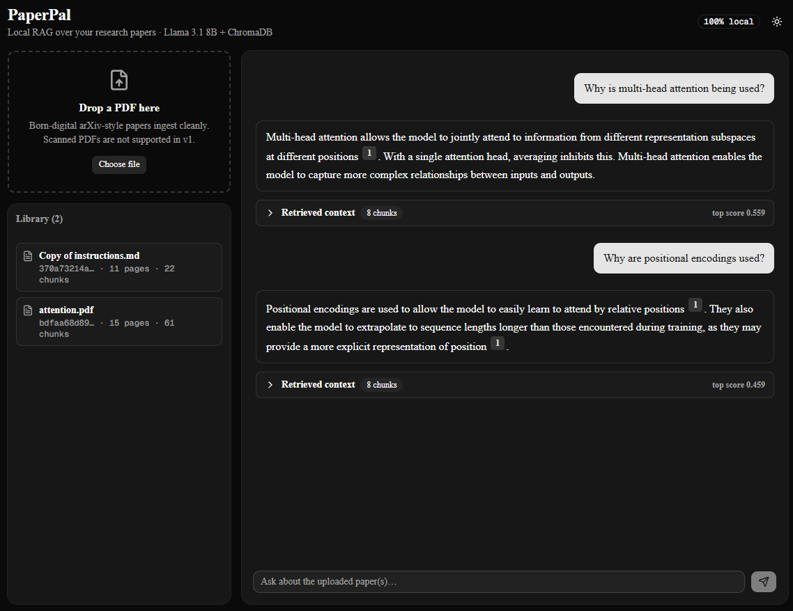

# PaperPal

> Chat over your research papers — fully local. Upload a PDF, ask grounded questions, get answers with inline page-anchored citations. Runs on a local Llama 3.1 model with **no API keys, no cloud LLM dependency, and zero ongoing cost**.

**Live demo:** [paperpal-bay.vercel.app](https://paperpal-bay.vercel.app/) (frontend on Vercel, backend on [HuggingFace Spaces](https://huggingface.co/spaces/Zao0531/paperpal-backend), LLM via Groq's free tier — see [Deployment](#deployment) below for the architecture)



## Why

Most "chat with your PDFs" demos call out to a paid API. PaperPal stays on your machine end-to-end:

- **Privacy.** Your PDFs never leave your laptop.
- **Cost.** $0 to run, forever. No tokens metered, no monthly minimums.
- **Reproducibility.** No upstream API changes can break your eval results.

The local-LLM constraint isn't a downgrade — it's the spec. PaperPal is intentionally a portfolio piece for working with the open-source LLM stack (Ollama, sentence-transformers, ChromaDB) glued together with modern Python + TypeScript.

## What it does

- **Page-aware PDF ingestion** — `pymupdf` parses each page, then a recursive character splitter chunks while preserving page numbers.
- **Semantic retrieval** — chunks are embedded with a sentence-transformer and stored in a persistent ChromaDB collection.
- **Grounded answers** — the retrieved chunks are passed to a local Llama 3.1 model with a system prompt that requires every claim be cited as `[paper_id:page]`.
- **Streaming UI** — answers stream token-by-token over Server-Sent Events, with inline clickable citations that pop the underlying snippet, plus a "Retrieved context" devtool view that shows exactly what the model saw.
- **Library management** — drag-drop upload, hover-to-delete, dark mode.

## Architecture

```
┌──────────────────────┐                ┌────────────────────────────────────┐
│  Next.js 16          │   /api/*       │  FastAPI (Python 3.11)             │
│  React 19 + Tailwind │ ────────────▶  │   /upload   PDF → chunks           │
│  shadcn/ui + SSE     │   (proxy)      │   /query    SSE: retrieved+tokens  │
│  Vercel-ready        │                │   /docs     CRUD on ingested papers│
└──────────────────────┘                └──────────┬─────────────────────────┘
                                                   │
                              ┌────────────────────┴──────────────────┐
                              ▼                                       ▼
                    ┌──────────────────┐               ┌──────────────────────┐
                    │  ChromaDB        │               │  Ollama              │
                    │  persistent vol  │               │  Llama 3.1 8B        │
                    │  + MiniLM embeds │               │  localhost:11434     │
                    └──────────────────┘               └──────────────────────┘
```

The frontend's Next.js Route Handlers proxy every backend call so the browser never sees the FastAPI URL and never deals with CORS.

## Tech stack

| Layer            | Tool                                                      | Why                                                              |
| ---------------- | --------------------------------------------------------- | ---------------------------------------------------------------- |
| LLM (local)      | **Ollama** + Llama 3.1 8B                                 | Default. Free, offline, no API key. Privacy-preserving.          |
| LLM (cloud)      | **Groq** + `llama-3.1-8b-instant`                         | Optional fallback for hosted deployments. ~10× faster than CPU Ollama. Free tier requires no credit card. Selected via `LLM_PROVIDER=groq`. |
| Embeddings       | **sentence-transformers** `all-MiniLM-L6-v2`              | Fast, runs on CPU, swappable for ablations                       |
| Vector store     | **ChromaDB** (persistent client)                          | Zero-config local store; easy migration path to Pinecone/Weaviate |
| PDF parsing      | **pymupdf**                                               | Fast, page-aware, handles ligatures and multi-column layouts     |
| Backend          | **FastAPI** + **uvicorn** + **pydantic v2**               | Modern async Python, typed throughout                            |
| Frontend         | **Next.js 16** App Router + **React 19** + **TypeScript** | Streaming-first, server-rendered shell, typed API surface        |
| Styling          | **Tailwind 4** + **shadcn/ui** + **next-themes**          | Accessible primitives, dark mode out of the box                  |
| Streaming        | **Server-Sent Events** end-to-end                         | Simpler than WebSockets for one-way token streams                |

## Quick start

**Prerequisites**

- Python **3.11+** (project pins to 3.11.x via `.python-version`)
- Node.js **20+**
- [Ollama](https://ollama.com/download) installed and running

### 1. Pull the local LLM

```sh
ollama pull llama3.1:8b
```

(~5 GB, one-time download. Smaller alternatives: `llama3.2:3b`, `phi3.5:3.8b`. Set the model via `OLLAMA_MODEL` in `backend/.env`.)

### 2. Backend

```sh
cd backend
python -m venv .venv
.venv\Scripts\activate            # Windows
# source .venv/bin/activate       # macOS / Linux

pip install -e .[dev]
cp .env.example .env              # defaults work out of the box
uvicorn app.main:app --reload
```

Backend runs on http://127.0.0.1:8000.

### 3. Frontend

In a second terminal:

```sh
cd frontend
npm install
cp .env.example .env.local        # points at the backend
npm run dev
```

Open **http://localhost:3000**.

### 4. Use it

- Drag-drop a PDF (born-digital arXiv-style PDFs work best — scanned PDFs require OCR which v1 doesn't ship)
- Ask a question
- Click any `[1]` superscript to see the source snippet
- Expand "Retrieved context" to see all chunks the retriever returned, with cosine-similarity scores

### Run tests

```sh
cd backend
pytest
```

Six smoke tests covering chunking, ligature/hyphen normalization, page metadata, and chunk-id stability.

## Project structure

```
PaperPal/
├── backend/
│   ├── app/
│   │   ├── config.py            env-driven settings (pydantic-settings)
│   │   ├── models.py            pydantic request/response schemas
│   │   ├── ingest.py            page-aware PDF chunking
│   │   ├── embeddings.py        sentence-transformers wrapper (swappable)
│   │   ├── store.py             ChromaDB persistent vector store
│   │   ├── rag.py               retrieval + Ollama streaming chat
│   │   └── main.py              FastAPI app: /upload /query /docs /healthz
│   ├── tests/                   pytest smoke tests
│   ├── Dockerfile
│   ├── pyproject.toml
│   └── .env.example
└── frontend/
    ├── src/
    │   ├── app/
    │   │   ├── api/             route handlers proxying to FastAPI
    │   │   ├── layout.tsx       theme provider, fonts
    │   │   └── page.tsx         home: upload + library + chat
    │   ├── components/
    │   │   ├── Chat.tsx         streaming chat with cancel
    │   │   ├── Citation.tsx     parses [paper:page] → clickable popovers
    │   │   ├── RetrievedChunks.tsx  devtool drawer with scored chunks
    │   │   ├── Upload.tsx       drag-drop file upload
    │   │   ├── ThemeProvider.tsx + ThemeToggle.tsx
    │   │   └── ui/              shadcn primitives
    │   └── lib/
    │       └── api.ts           typed fetch + SSE parser
    └── package.json
```

## Deployment

PaperPal ships in two modes from the same codebase:

```
        Local mode (default)                      Cloud mode (deployed demo)
    ┌────────────────────────┐                ┌────────────────────────────┐
    │ Browser → localhost    │                │ Browser → Vercel (Next.js) │
    │   ↓                    │                │   ↓ /api/* proxy           │
    │ Next.js dev server     │                │ FastAPI on HF Spaces       │
    │   ↓ /api/* proxy       │                │   ↓                        │
    │ FastAPI on localhost   │                │ Groq cloud LLM             │
    │   ↓                    │                │ + ChromaDB (ephemeral)     │
    │ Ollama on localhost    │                │ + sentence-transformers    │
    │ + ChromaDB persisted   │                │                            │
    └────────────────────────┘                └────────────────────────────┘
```

The backend abstracts the LLM behind a `LLMProvider` Protocol with two drivers (`OllamaProvider`, `GroqProvider`). One env var (`LLM_PROVIDER=ollama|groq`) flips the whole pipeline. The retrieval logic, citation rules, and SSE streaming are identical across modes.

Free-tier deployment stack:

| Component | Host | Why |
|---|---|---|
| Frontend | Vercel (Hobby plan) | Built by the Next.js team; auto-deploys from `main` |
| Backend | HuggingFace Spaces (free CPU Docker) | 16 GB RAM, no credit card; `backend/` is pushed via `git subtree push` |
| LLM | Groq free tier | 30 req/min, 14400 req/day; `llama-3.1-8b-instant` |

Caveats of the free Space tier: cold-start ~30 sec after ~48 h of inactivity; ephemeral filesystem (uploaded PDFs and the ChromaDB index reset on Space restart). Good enough for a portfolio demo; for real use, run locally with Ollama or upgrade the Space to a persistent tier.

## Roadmap

- ✅ **Backend core** — page-aware ingestion, ChromaDB, Ollama streaming
- ✅ **Frontend** — Next.js 16, streaming chat, citations, retrieved-chunks devtool, dark mode, library CRUD, persistent chat history
- ✅ **Public deployment** — swappable `LLMProvider` (Ollama local + Groq cloud), Vercel + HuggingFace Spaces, [live demo](https://paperpal-bay.vercel.app/)
- ⏳ **Eval harness** — RAGAS metrics + custom citation accuracy + chunk/k/embedding ablations + no-RAG baseline (`backend/eval/`)
- ⏳ **MLOps polish** — `docker-compose` for one-command bring-up, GitHub Actions CI for lint + typecheck + tests, `MODEL_CARD.md`, `WRITEUP.md`

## License

MIT — see [LICENSE](LICENSE).
